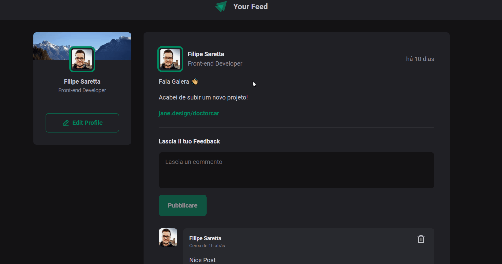

<h1 align="center"> TODO </h1>

<p align="center">
  <a href="#tech">Tech</a>&nbsp;&nbsp;&nbsp;|&nbsp;&nbsp;&nbsp;
  <a href="#project">Projeto</a>&nbsp;&nbsp;&nbsp;|&nbsp;&nbsp;&nbsp;
  <a href="#getting-started">Getting Started</a>
</p>


## Tech

- React
- Typescript


## Getting Started

Clone the project and access the folder.

```
git clone https://github.com/filipesaretta/your-feed

cd your-feed
```

Install the dependencies and start.

``` 
npm install

npm run dev
```

## Project 



Practicing the basics of react and typescript

The design is from a class by [Rocketseat](https://github.com/rocketseat-content).